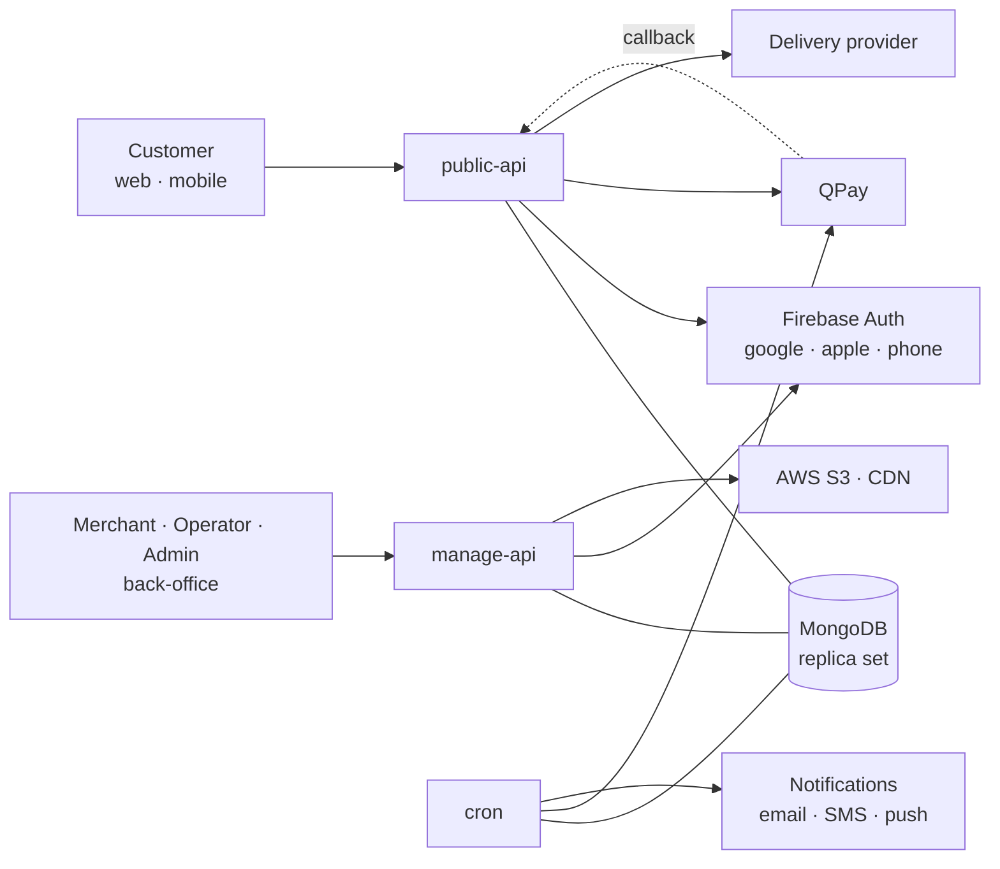
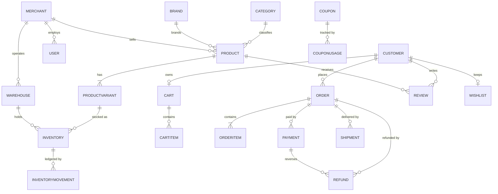
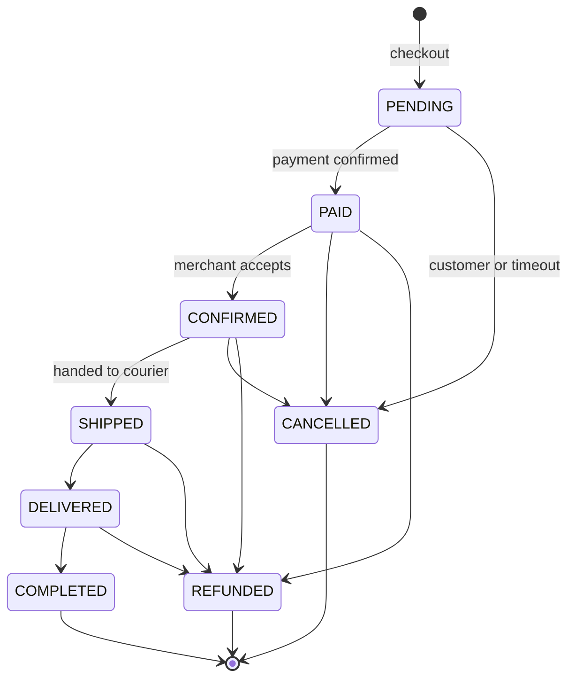
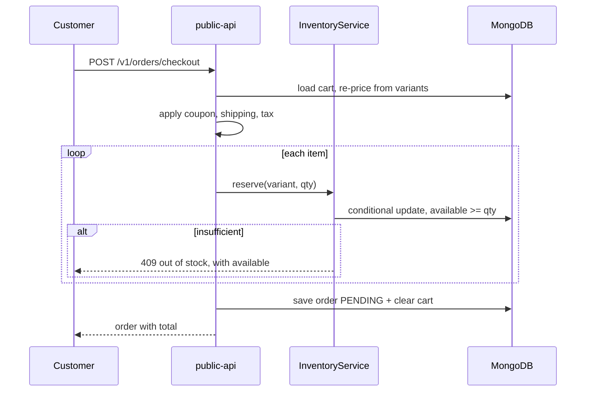
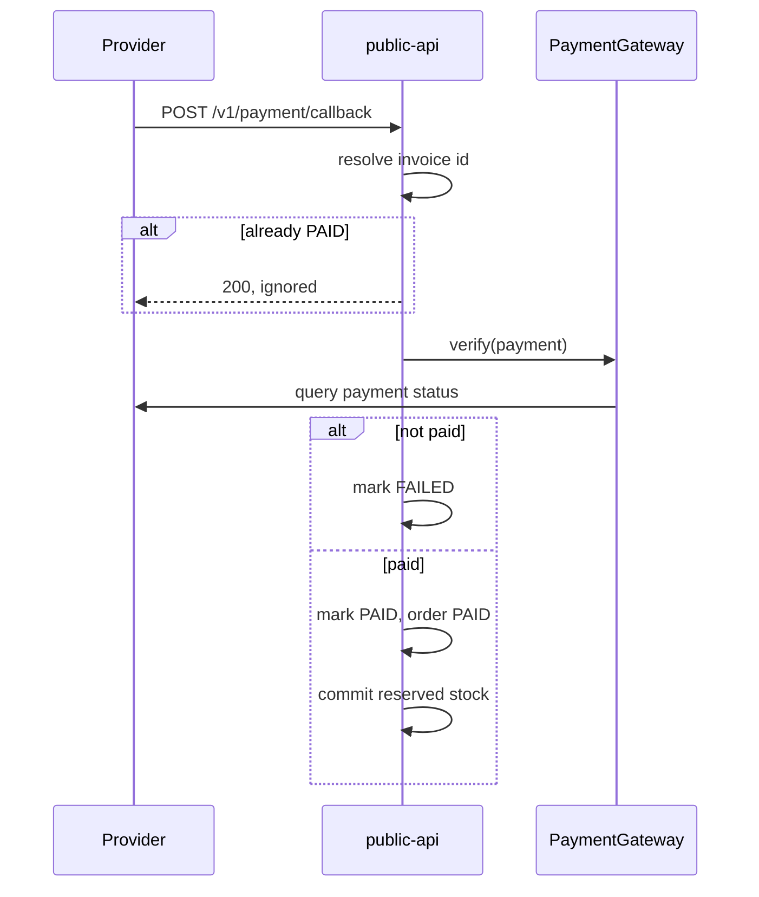

# Market — System Requirements & Analysis

Working document for the team. Scope is the whole product: backend, storefront
web, mobile apps and back-office. Requirements are written from the user's side,
independent of which component implements them.

Status reflects `market-backend` as of the current commit.
`Built` · `Partial` — scaffolded or stubbed · `Todo` — not started.

---

## 1. Product

A **multi-merchant marketplace** for Mongolia. Merchants list products; customers
browse, order and pay online; the platform takes a commission per order and
settles the remainder to merchants.

This is a marketplace, not a single store — `Merchant.commissionRate` and
per-item `merchantId` on every order line commit us to that, and it drives the
settlement, per-merchant fulfilment and payout requirements below.

Primary market is Mongolia: MNT pricing, Ulaanbaatar timezone, `mn`/`en` content.

---

## 2. Actors

| Actor | Reaches system via | Purpose |
|---|---|---|
| **Customer** | storefront web, mobile app | Browse, buy, track, review |
| **Guest** | storefront web, mobile app | Browse and build a cart before signing in |
| **Merchant** | back-office | Own catalog, stock, orders, payouts |
| **Operator** | back-office | Platform staff: order support, moderation |
| **Admin** | back-office | Users, merchants, config, commission |
| **System** | cron | Order expiry, reconciliation, alerts |

Roles are `ApplicationRole`. Merchant staff carry `merchantId` in their JWT, and
every back-office query is scoped by it.

---

## 3. System context

**External dependencies:** Firebase Auth (identity), QPay (payment), a delivery
provider, AWS S3 (media), MongoDB. Notifications and the tax-receipt integration
are not built.

---

## 4. Domain model

**Glossary of the load-bearing ones:**

- **Product** — the catalog entry. Not purchasable itself.
- **ProductVariant** — what is actually bought: one option combination with its
  own SKU, price, barcode. Price range and stock total on Product are
  denormalized from variants for listing.
- **Inventory** — stock per variant per warehouse. `available = quantity − reserved`.
- **InventoryMovement** — append-only ledger; replaying it must reproduce Inventory.
- **Cart** — active basket. Guests keyed by `sessionId`, merged on login.
- **Order** — immutable snapshot. Product name, price, options and address are
  copied at checkout so catalog edits never rewrite history.
- **Payment** — one attempt against an order; an order may have several.
- **Coupon / CouponUsage** — discount rules and per-customer usage enforcement.

---

## 5. Lifecycles

### Order

Transitions are enforced in `OrderStatus.next()`; an illegal move is rejected,
not logged.

### Payment

`NEW → PENDING → PAID | FAILED | CANCELLED`, then `REFUNDED` or
`PARTIALLY_REFUNDED`.

### Shipment

`CREATED → PICKED_UP → IN_TRANSIT → OUT_FOR_DELIVERY → DELIVERED`, with `FAILED`
and `RETURNED` as terminal alternatives.

---

## 6. Epics and stories

### E1 — Identity and accounts

| ID | Story | Acceptance | Status |
|---|---|---|---|
| E1-S1 | As a customer I sign in with Google, Apple or my phone number | One endpoint; provider is a claim in the token; a new customer is created on first sign-in | Built |
| E1-S2 | As a customer I sign in with email and password | Rejects social-only accounts with a clear message, not "wrong password" | Built |
| E1-S3 | As a customer I register with email and password | Duplicate email or phone is rejected; password stored bcrypt | Partial — service exists, **no endpoint** |
| E1-S4 | As a customer I manage my profile and address book | Add, edit, remove, set default; default is unique per customer | Partial — service exists, **no endpoint** |
| E1-S5 | As a customer my accounts merge when I use a second sign-in method | Same person via Google then phone resolves to one Customer | Built — via verified email or phone linking |
| E1-S6 | As a customer I delete my account | Personal data removed or anonymized; orders retained for accounting; Apple token revoked | Todo |
| E1-S7 | As an admin I manage back-office users and roles | Create, assign role, scope to merchant, deactivate | Todo |

### E2 — Catalog

| ID | Story | Acceptance | Status |
|---|---|---|---|
| E2-S1 | As a merchant I create a product with variants | SKU unique; slug auto-generated; price range derived from variants | Built |
| E2-S2 | As a merchant I upload product images | Stored in S3, served via CDN, size and type validated | Partial — S3 service exists, **no upload endpoint** |
| E2-S3 | As an admin I manage the category tree | Ancestors recomputed on move; subtree query is one lookup | Partial — service exists, **no endpoint** |
| E2-S4 | As an admin I manage brands | CRUD, slug unique | Todo — entity only |
| E2-S5 | As a customer I browse a category including subcategories | Products under any descendant are returned | Built |
| E2-S6 | As a merchant I publish or unpublish a product | Only `ACTIVE` products appear on the storefront | Built |

### E3 — Search and discovery

| ID | Story | Acceptance | Status |
|---|---|---|---|
| E3-S1 | As a customer I search products by name or SKU | Matches `mn` and `en` names | Built — regex; **does not use the declared text index** |
| E3-S2 | As a customer I filter by category, brand, price and availability | Filters combine; all optional | Built |
| E3-S3 | As a customer I sort by price, newest or popularity | Stable ordering across pages | Partial — generic sort only |
| E3-S4 | As a customer I see featured products and banners on the home page | Scheduled by start/end date and position | Todo — entities only |
| E3-S5 | As a customer I get relevant results for misspelled Mongolian input | Tolerates Cyrillic/Latin transliteration | Todo |

### E4 — Cart and checkout

| ID | Story | Acceptance | Status |
|---|---|---|---|
| E4-S1 | As a guest I build a cart before signing in | Keyed by session; expires after 30 days | Built |
| E4-S2 | As a customer my guest cart merges on sign-in | Quantities summed per variant, guest cart deleted | Built |
| E4-S3 | As a customer I see current prices in my cart | Re-priced from the variant on every read | Built |
| E4-S4 | As a customer I check out and my stock is held | Order `PENDING`, stock reserved atomically, cart cleared | Built |
| E4-S5 | As a customer I cannot buy more than is available | Rejected with the available quantity, not a generic error | Built |
| E4-S6 | As a customer I apply a coupon | Validity, window, usage limits and minimum order enforced | Built |
| E4-S7 | As a customer I choose delivery type and address | Address snapshotted onto the order | Built |
| E4-S8 | As a customer my unpaid order releases its stock | Cancelled after the configured timeout, stock returned | Built |
| E4-S9 | As a customer I check out items from several merchants at once | Order split per merchant for fulfilment, one payment | Partial — items carry `merchantId`, **no split logic** |

### E5 — Payments

| ID | Story | Acceptance | Status |
|---|---|---|---|
| E5-S1 | As a customer I pay with QPay | Invoice created, QR returned, order marked paid on confirmation | Partial — **HTTP calls are stubs** |
| E5-S2 | As the system I never trust a payment callback | Gateway re-queried before marking paid; repeat callbacks ignored | Built |
| E5-S3 | As the system I catch payments whose callback never arrived | Pending invoices re-checked and settled or expired | Partial — job logs only |
| E5-S4 | As a customer I pay by card / SocialPay / bank transfer / cash on delivery | Each method selectable at checkout | Todo — enum only |
| E5-S5 | As a customer I receive a valid VAT receipt (ebarimt) | Receipt issued to the tax authority and returned to the customer | Todo — **see D4** |

### E6 — Fulfilment and delivery

| ID | Story | Acceptance | Status |
|---|---|---|---|
| E6-S1 | As a merchant I accept and pack an order | `PAID → CONFIRMED`, transition recorded with actor | Built |
| E6-S2 | As a merchant I create a shipment and get a tracking number | Registered with the provider | Partial — flat-rate self-courier only |
| E6-S3 | As a customer I track my delivery | Status and history visible without signing in, by tracking number | Todo |
| E6-S4 | As a customer I pay the correct delivery fee | Fee by zone/weight; free above a threshold | Partial — flat fee + threshold only |
| E6-S5 | As an operator I handle a failed delivery | Retry or return, stock and refund handled | Todo |

### E7 — Returns and refunds

| ID | Story | Acceptance | Status |
|---|---|---|---|
| E7-S1 | As a customer I request a return within the allowed window | Request recorded against specific order items | Todo — **no RMA model** |
| E7-S2 | As a merchant I approve or reject a return | Decision and reason recorded | Todo |
| E7-S3 | As an operator I refund fully or partially | Refund via the original payment method; order reflects it | Partial — entity only, no workflow |
| E7-S4 | As the system returned stock re-enters inventory after inspection | Movement ledgered as `RETURN` | Todo |

### E8 — Inventory

| ID | Story | Acceptance | Status |
|---|---|---|---|
| E8-S1 | As a merchant I adjust stock | Movement ledgered; product totals refreshed | Built |
| E8-S2 | As the system stock cannot oversell under concurrency | Two simultaneous checkouts for the last unit: one succeeds | Built — conditional atomic update |
| E8-S3 | As a merchant I am alerted when stock runs low | Alert per merchant below threshold | Partial — job logs only |
| E8-S4 | As a merchant I manage multiple warehouses | Stock per warehouse; fulfilment picks a source | Todo — entity only, one hardcoded warehouse |
| E8-S5 | As a merchant I import stock in bulk | Excel upload, validated with a per-row error report | Todo |

### E9 — Merchant

| ID | Story | Acceptance | Status |
|---|---|---|---|
| E9-S1 | As a merchant I register and am approved | Application, review, activation | Todo — entity only |
| E9-S2 | As a merchant I see my sales and commission | Per-order commission visible | Todo |
| E9-S3 | As a merchant I am paid out on a schedule | Payout run produces a statement and a bank transfer record | Todo — **no payout model, see D2** |
| E9-S4 | As a merchant I manage my store profile | Logo, cover, description, contacts | Todo |

### E10 — Promotions

| ID | Story | Acceptance | Status |
|---|---|---|---|
| E10-S1 | As an admin I create a coupon | Percent or fixed, caps, windows, usage limits | Partial — model and validation, **no endpoint** |
| E10-S2 | As an admin I restrict a coupon to products, categories or merchants | Only matching lines discounted | Built |
| E10-S3 | As an admin I run a sale price on a variant | `comparePrice` shown struck through | Partial — field only |
| E10-S4 | As an admin I schedule home-page banners | By position and date window | Todo — entity only |

### E11 — Reviews and content

| ID | Story | Acceptance | Status |
|---|---|---|---|
| E11-S1 | As a customer I review a product I received | One review per order item; flagged verified purchase | Todo — entity only |
| E11-S2 | As an operator I moderate reviews | Approve or reject before publication | Todo |
| E11-S3 | As a customer I keep a wishlist | Add, remove, list | Todo — entity only |

### E12 — Back-office and operations

| ID | Story | Acceptance | Status |
|---|---|---|---|
| E12-S1 | As an operator I search orders by number, phone, status and date | Merchant staff see only their own | Built |
| E12-S2 | As an operator I move an order through its lifecycle | Illegal transitions rejected | Built |
| E12-S3 | As an operator I see a full audit trail on an order | Every status change with actor and time | Built |
| E12-S4 | As an admin I change settings without a deploy | Shipping fee, tax rate, timeout, commission | Partial — read path only, **no admin endpoint** |
| E12-S5 | As an admin I see sales dashboards | Revenue, orders, top products, by period | Todo |

### E13 — Notifications

| ID | Story | Acceptance | Status |
|---|---|---|---|
| E13-S1 | As a customer I am notified when my order status changes | Via push, SMS or email per preference | Todo |
| E13-S2 | As a merchant I am notified of a new order | Within minutes | Todo |
| E13-S3 | As a customer I receive an order confirmation | Itemized, in my language | Todo |

---

## 7. Key flows

### Checkout

The reservation filter itself asserts sufficient stock, so concurrent checkouts
cannot oversell without a lock. The whole flow is one transaction — which is why
MongoDB must be a replica set.

### Payment confirmation

---

## 8. Non-functional requirements

| Area | Requirement | Status |
|---|---|---|
| **Security** | Stateless JWT; storefront and back-office tokens carry role and merchant scope | Built |
| **Security** | Account linking only on a provider-verified email or phone | Built |
| **Security** | No credentials in the repo; all secrets from environment | Built |
| **Security** | Rate limiting on auth and checkout | Todo |
| **Correctness** | Money as `BigDecimal`/Decimal128, never floating point | Built |
| **Correctness** | Stock cannot oversell under concurrency | Built |
| **Correctness** | Orders immutable against later catalog edits | Built |
| **Availability** | Target uptime and maintenance window | **Undecided — D6** |
| **Performance** | Catalog listing p95 under load; peak concurrent checkouts | **Undecided — D6** |
| **Localization** | All customer-facing text in `mn` and `en`, via `Accept-Language` | Built |
| **Localization** | MNT pricing, Asia/Ulaanbaatar timestamps | Built |
| **Observability** | Structured logs, health endpoints | Partial — health only |
| **Compliance** | Personal data retention and deletion policy | **Undecided — D5** |

---

## 9. Open decisions

These block design work and need a human answer.

| ID | Decision | Why it matters |
|---|---|---|
| **D1** | Commission: flat rate, or per category / per merchant? | Changes the settlement model and the order-level data we must retain |
| **D2** | Merchant payout: schedule, minimum, who bears refund cost? | **No payout or settlement entity exists.** Core marketplace flow, currently unmodelled |
| **D3** | Returns: window, who pays return shipping, restocking rules? | Drives the whole RMA model in E7 |
| **D4** | Is ebarimt (VAT receipt) issuance required for us? | Legal. Adds fields to Order and a hard integration — far cheaper now than retrofitted |
| **D5** | Personal data retention and deletion policy | Required for E1-S6, and Apple requires account deletion for App Store apps |
| **D6** | Expected volumes: SKUs, orders/day, peak concurrency, uptime target | Determines whether the single-Mongo design holds |
| **D7** | Delivery: own couriers, a partner, or both? UB vs aimag pricing? | Shapes `DeliveryProvider` implementations and fee rules |
| **D8** | Which payment methods at launch beyond QPay? | Each is a gateway implementation |
| **D9** | Multi-merchant orders: split into sub-orders, or keep one order? | Affects fulfilment, payout and the customer's order view (E4-S9) |

---

## 10. Where the gaps are

Grouped by how much design they need, not by size.

**Endpoints missing over working services** — the logic exists and is tested by
nothing; these are thin: customer registration (E1-S3), profile and addresses
(E1-S4), category management (E2-S3), coupon management (E10-S1), image upload
(E2-S2), system config admin (E12-S4).

**Stubs that must become real** — QPay HTTP calls (E5-S1), payment
reconciliation (E5-S3), low-stock alerts (E8-S3), delivery tracking (E6-S2).

**Entities with nothing behind them** — Brand, Banner, Review, Wishlist,
Warehouse, Merchant, Refund. Each needs service, API and rules.

**Not modelled at all — needs design first** — merchant payout and settlement
(D2), the returns/RMA workflow (D3), notifications (E13), ebarimt (D4),
multi-merchant order splitting (D9), analytics (E12-S5).
